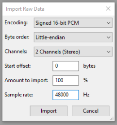

# podbot
A Discord bot designed to record voice chat audio, aimed at recording a specific podcast.

Click [here](https://discordapp.com/oauth2/authorize?client_id=270724051234717698&scope=bot&permissions=133237760) to add my instance of it.

It's worth noting that you'll need to host the bot yourself if you want access to the recording it makes - if you just use my instance you rely on me giving you the audio it generates.

### GIB PODCAST NAO
~~Someone has actually adapted this project and wrapped it up in a user-friendly package.  
Go take a look at [podframe](https://podframe.com/) if you want to be able to just add a bot
and start recording.~~

~~(This is made by some chap by the name of _leanon over on this [reddit thread](https://www.reddit.com/r/discordapp/comments/6733u8/i_made_a_discord_bot_which_lets_you_record_a/?st=j1yqjsv8&sh=d25c1299))~~

Podframe is ded, you'll need to run your own podbot.

- Clone this repo and do the thing with the discord and the applications.
- Run `node index.js` or `npm run podbot` and go through the prompts to initialize configuration
    - when prompted enter your bot token (right click to paste into the terminal)
    - the default options will set podbot up to be controllable by users with roles named "podhandler". Create this role on your server and assign it accordingly
    - you can use the `controllers.users` array to make specific users able to control the bot regardless of the server they're in
- If `./config.json` already exists this initialisation will be skipped. Edit it manually if you want to tweak it afterwards

### Using Docker to run the bot:
- Update config.ini with your values (or pass in the env with whatever container orchestrator you're using)
- docker build -t podbot .
- docker run -d --env-file config.ini --name podbot podbot
- Your opus_string files are (by default) at /opt/podbot/podcasts, you will want to mount a volume there to get them out
- As of right now this container doesn't support processing the audio files

### Using the bot:
- `/podon` - The bot joins the voice channel the command user is in and starts recording
- `/podoff` - The bot stops recording and leaves the voice channel the command user is in
  
The bot will generate audio fragments saved to `podbot\podcasts\<channelId-timestamp>.opus_string`. 

These can be decoded and reassembled by running `npm run process` and picking the desired podcast session from the list.

If you've got the podcast recording folder in a non-standard location you can process it by running `npm run process <path to podcast directory>`.

This will generate a file for each recorded user with their discord ID as the filename.
These files can then be imported into your favourite audio software (such as [Audacity](https://www.audacityteam.org/)) side by side and everything should line up on the timeline nicely.

The output is signed 16-bit little endian PCM at 48KHz with 2 channels.
Use the following options when importing into Audacity:

Once you've imported all the different user tracks you can then export in your audio format of choice.
